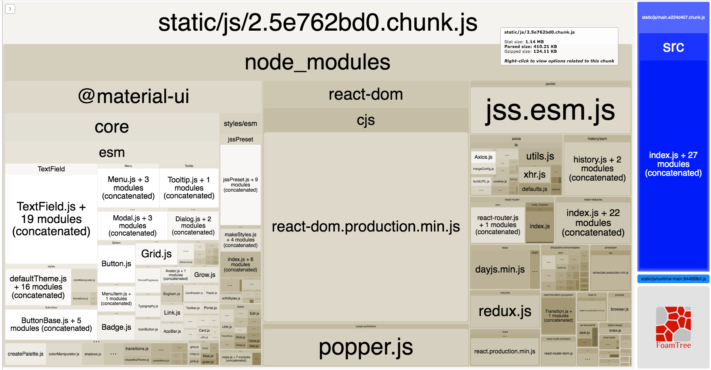

# Group Grid

  
Social media application implemented with the React library and REST interfaces supported by Firebase cloud functions. [Live Link](https://groupgrid-1d191.firebaseapp.com/)

## Technologies

• React  
• React Router  
• Redux  
• Redux Thunk  
• Axios  
• Firebase Database  
• Firebase Cloud Functions  
• Material-UI  

## Bundle Size


## Features

• Users can update their profile image.  
• Users can edit their own profile details including bio, website, and location.  
• Users can like and comment on another user's post.  
• User_A will receive a notification when User_B either likes or comments on User_A's post.  
• Users can create a post and delete their created post.

---

## Highlight Demonstrations

### ⭐ Users can edit their own profile details including profile image, bio, website, and location.

Upon signup, users are assigned a default profile photo. To define the uploadProfileImage cloud function, we use the Busboy library to initiate a file event with a list of handlers as parameters. Inside the file event, a conditional for file types is set. Then we create necessary references to be able to use the file system library to create a file.
  
    
```
// Upload Profile Image
exports.uploadProfileImage = (req, res) => {
  ...
	busboy.on('file', (fieldname, file, filename, encoding, mimetype) => {
      if (mimetype !== 'image/jpeg' && mimetype !== 'image/png') {
        return res.status(400).json({ error: 'Wrong file type submitted' });
      }

      const imageExtension = filename.split('.').pop();
      imageFileName = `${Math.round(Math.random() * 100000000)}.${imageExtension}`;
      const filepath = path.join(os.tmpdir(), imageFileName);
      imageToBeUploaded = { filepath, mimetype };
      file.pipe(fs.createWriteStream(filepath));
    });
}
```
  
The bio, website, and location fields are empty when a user registers to the application. A user will be able to edit their profile details, once authenticated. Inside the addUserDetails cloud function, we access the values from our user's object that is returned from our validator function, reduceUserDetails. That object is what we update the user's details with.  

  
```
// Add User's Details
exports.addUserDetails = (req, res) => {
	let userDetails = reduceUserDetails(req.body);

  db.doc(`/users/${req.user.handle}`)
    .update(userDetails)
    .then(() => {
      return res.json({ message: 'Details added successfully' });
    })
    .catch((err) => {
      console.error(err);
      return res.status(500).json({ error: err.code });
    });
};
```

### ⭐ Users can like and comment on another user’s post.

Once authenticated, a user is able to like and unlike posts. A user is also able to comment on another user's post. Their comment is rendered in descending order from the time it was created. Inside the commentOnPost cloud function, we first validate that the comment field is not empty. If the field is not empty, we can construct a newComment object. Next, we access the post document the user commented on, then increment the comment count of the post and add the newComment object to the comments collection of our database.


```
// Comment on a Post
exports.commentOnPost = (req, res) => {
  ...
  db.doc(`/posts/${req.params.postId}`)
    .get()
    .then(doc => {
      if (!doc.exists) {
        return res.status(404).json({ error: 'Post does not exist.' });
			}
			return doc.ref.update({ commentCount: doc.data().commentCount + 1 })
		})
		.then(() => {
			return db.collection('comments').add(newComment);
		})
    .then(() => {
      res.json(newComment);
    })
    .catch(err => {
      console.log(err);
      res.status(500).json({ error: 'Something went wrong' });
    });
};
```

### ⭐ User_A will receive a notification when User_B either likes or comments on User_A's post.

When a user likes or comments on another user's post, the owner of the post will receive individual notifications for their post being liked and commented on. The notifications will be rendered in descending order from the time the action occurred. When the owner of the post clicks on a notification, it will lead the user to their profile page with the post dialog opened.  
The markNotificationsRead cloud function is designed in that, if the user has unread notifications, the client will send an array of read notifications to the server to update its list.  We use the batch method to update multiple documents to be marked as read, as we iterate through each notification of the array.  


```
// Mark a Notification as Read
exports.markNotificationsRead = (req, res) => {
  let batch = db.batch();
  req.body.forEach((notificationId) => {
    const notification = db.doc(`/notifications/${notificationId}`);
    batch.update(notification, { read: true });
  });
  batch
    .commit()
    .then(() => {
      return res.json({ message: 'Notifications marked read' });
    })
    .catch(err => {
      console.error(err);
      return res.status(500).json({ error: err.code });
    });
};
```
---
## Roadmap

• Users can upload an image along with the post.  
• Users can follow and unfollow each other.
